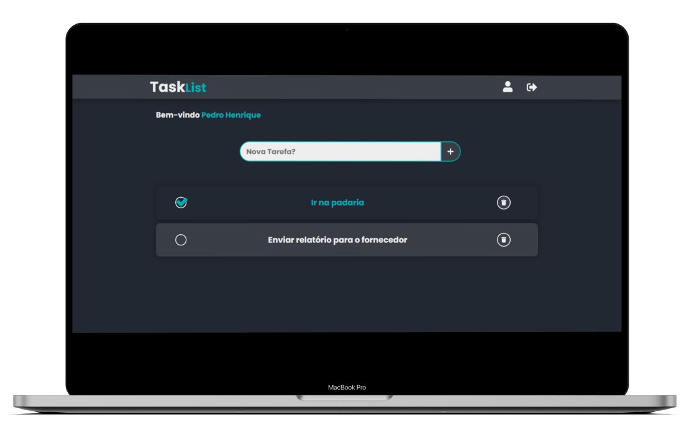

<h1 align="center"></h1>

<p align="center">
  <a href="#-sobre">💻 Sobre</a>&nbsp;&nbsp;&nbsp;|&nbsp;&nbsp;&nbsp;
  <a href="#-tecnologias">🔧 Tecnologias</a>&nbsp;&nbsp;&nbsp;|&nbsp;&nbsp;&nbsp;
  <a href="#-como-baixar-o-projeto">🚀 Como baixar o projeto</a>&nbsp;&nbsp;&nbsp;|&nbsp;&nbsp;&nbsp;
  <a href="#-licença">📄 Licença</a>
</p>

<p align="center">
  
</p>

## 💻 Sobre

O **TaskList** é um projeto com objetivo de gerenciar tarefas do dia-a-dia. Na aplicação criamos o usuário e após ser autenticado ele cria suas tarefas e assim que conclui-las ele dará um _"check"_ ao finalizar a tarefa.

Esse aplicativo foi desenvolvido no curso **Fábrica de App** do _Sujeito Programador_. No curso aprendemos a criar uma **API** com NodeJS, adicionando operações básicas do CRUD, criamos o database e service e configuramos as rotas e controllers.

No lado **Client**, criei as páginas com ReactJS onde é requisitado a API pelo _Axios_ e a estilização foi feita com Styled Components.

---

## 🔧 Tecnologias

O projeto foi desenvolvido com as seguintes tecnologias:

## Backend

- [NodeJS](https://nodejs.org/en/)
- [Express](https://expressjs.com/pt-br/)
- [Sequelize ORM](https://sequelize.org/)

## Frontend

- [ReactJS](https://pt-br.reactjs.org/)
- [Axios](https://axios-http.com/)
- [Styled Components](https://styled-components.com/)

---

## 🚀 Como baixar o projeto

```bash
# Clone o repositório.
$ git clone https://github.com/pedrohribeiross/TaskList.git

# Instalar as dependências.
$ yarn

# Rodar o servidor.
$ yarn dev

# Rodar o client.
$ yarn start

# A aplicação pode ser acessada no
  localhost:3000
```

---

## 📄 Licença

Esse projeto está sob a licença MIT. Veja o arquivo [LICENSE](LICENSE.md) para mais detalhes.

---

Desenvolvido 👍 por **Pedro Henrique Ribeiro**.
